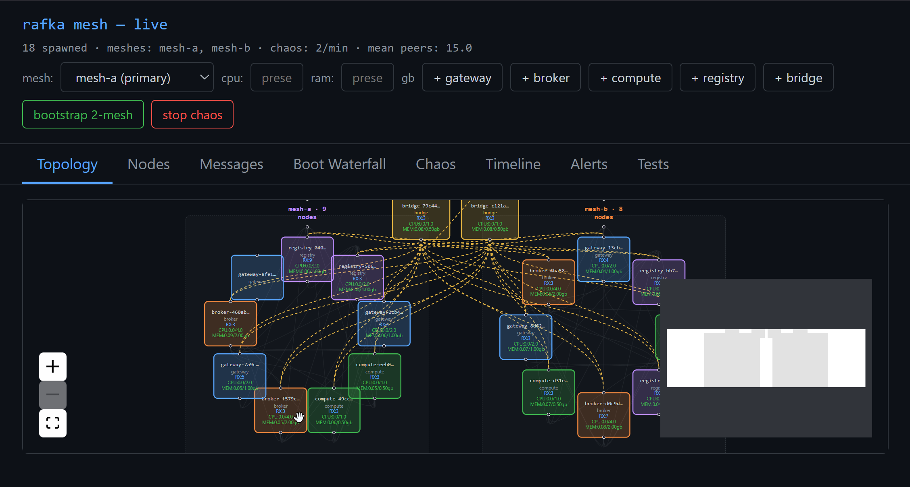

# rafkav2

A telemetry-first mesh substrate built on iroh (QUIC + NodeId crypto + mdns).
No JVM, no ZooKeeper. Every action is observable in Jaeger; every code path
emits a span. Chaos-tested under a 10-primitive catalog at multi-hour scale.



The admin-ui (`http://localhost:19090`) renders a live SVG of the 18-node
2-mesh bootstrap topology with per-node RX frame counts, CPU / RAM bars,
and dashed cross-mesh edges. Tabs cycle through Topology, Nodes, Messages,
Boot Waterfall, Chaos, Timeline, Alerts, and Tests.

## Quick start

```bash
# 1. Bring up Jaeger + OTLP collector (podman or docker)
podman compose -f E:/dev/rafka/deployment/dev/compose.test-otlp.yml up -d

# 2. Build the binaries (release for any perf measurement — see "Build profile" below)
cargo build --workspace --release

# 3. Launch admin-ui (substrate participant + browser UI + child spawner)
CARGO_TARGET_DIR=$(pwd)/target RAFKA_CHILD_BUILD_PROFILE=release \
    ./target/release/rafka-admin-ui
# → http://localhost:19090

# 4. Open Jaeger
# → http://localhost:16686
```

The admin-ui has these tabs:
- **Topology** — live SVG mesh graph grouped by mesh_id (cross-mesh edges dashed)
- **Nodes** — per-node card with CPU + RAM bars always visible; click to expand for peer list + frame counters
- **Messages** — recent frame ring-buffer
- **Boot Waterfall** — last boot trace per service
- **Chaos** — start/stop continuous kill-and-respawn loop
- **Timeline** — unified chronological feed (node.spawn / peer.connected / chaos.kill / etc.)
- **Alerts** — chaos detection failures **and** any node exceeding CPU or RAM thresholds (see "Alerting")
- **Tests** — run shipped chaos/functional tests by name

Spawn buttons inline (gateway / broker / compute / registry / bridge).

## Build profile (debug vs release)

**Debug builds are 5–20× slower per substrate operation than release** — most of that gap is `iroh-quinn-proto` running unoptimized. Use release for any CPU / capacity measurement; debug is fine for iteration.

Measured steady-state broker CPU (18-node mesh, no chaos):

| Build | OS | mean cores / broker |
|---|---|---|
| Debug | Windows | 0.07–0.16 (mean ~0.12) |
| Release | Windows | 0.02–0.03 (mean ~0.020) |
| Release | Linux (WSL2) | 0.013–0.020 (mean ~0.017) |

Release on Windows ≈ release on Linux — OS makes essentially no difference at release opt-level. Debug numbers are misleading for any capacity discussion; the 6× extra cost is `iroh-quinn-proto` debug-build overhead, not your code.

CPU scales with how much gossip a node has to chew through (`topics_joined × peers_in_those_topics`). At release: ~0.015 cores fixed + ~0.002 cores per peer connection per topic. Bridges run ~0.04 cores because they subscribe to two gossip topics; gateways near ~0.025 because they typically aggregate the most in-topic peers.

RAM: ~0.05 GB per substrate node; admin-ui ~0.08 GB.

## Deployment artifact layout

Binaries land under `$CARGO_TARGET_DIR/$RAFKA_CHILD_BUILD_PROFILE/`. Admin-ui spawns child nodes from that same path, using `std::env::consts::EXE_SUFFIX` so `.exe` is appended on Windows and omitted on Linux automatically.

Required env to launch admin-ui:

| Env var | Purpose |
|---|---|
| `CARGO_TARGET_DIR` | Workspace target directory (absolute path) |
| `RAFKA_CHILD_BUILD_PROFILE` | `release` or `debug` — selects subdir for child spawn |

Both are validated at admin-ui startup via the preflight check — missing binaries fail loud rather than silently failing on first bootstrap.

A reference launcher is at `E:/tmp/soak-logs/launch-admin-ui-linux.sh` — pure env-var driven, no hardcoded paths, suitable for systemd or container ENTRYPOINT.

## Alerting

Admin-ui's `/api/alerts` (and the Alerts tab) emits warn-severity alerts for:

1. Chaos primitive detections with non-`passed` result (read from Jaeger)
2. **Any substrate node whose latest `GossipDigest.cpu_used` exceeds `RAFKA_CPU_ALERT_THRESHOLD`** (default **0.10 cores** — ~5× release baseline)
3. **Any substrate node whose `ram_used` exceeds `RAFKA_RAM_ALERT_THRESHOLD_GB`** (default **0.5 GB** — ~8× release baseline)

Admin-ui itself is excluded from CPU/RAM threshold checks since it does extra HTTP/orchestration work beyond pure substrate participation and would otherwise flap near the threshold.

## CLI: `rfa`

```bash
# Spawn / kill / list nodes via topology-ui REST
rfa mesh node add --type broker
rfa mesh node list
rfa mesh node remove broker-XYZ

# Chaos primitives
rfa mesh chaos kill [--target NAME]
rfa mesh chaos restart [--target NAME]
rfa mesh chaos soak --duration 1h --interval 20s --seed 42
```

## Chaos catalog (10 of 13 shipped)

| Primitive | What it does |
|---|---|
| kill_node | terminate a node abruptly |
| restart_node | kill + immediate re-spawn |
| burst_kill | N back-to-back kills |
| disk_full | fill spawn data dir until writes fail |
| wedge_node | Windows NtSuspendProcess + revert |
| partition_pair | New-NetFirewallRule blocking outbound UDP (needs admin) |
| clock_skew | restart with RAFKA_CLOCK_SKEW_MS env injected |
| slow_link | restart with RAFKA_LINK_SLOW_MS env (per-frame sleep) |
| lossy_link | restart with RAFKA_LINK_LOSS_PCT env (per-frame drop dice) |
| nat_shift | restart with new RAFKA_NODE_BIND_ADDR (ephemeral port) |

Queued: partition_subset, flap_link, firewall_inbound (all admin-required).

## Robustness evidence

Reports in `docs/evidence/`:

| Run | Pool | Duration | Result |
|---|---|---|---|
| 30min-soak-seed-900 | 4 prim | 30m | 117/117 ✓ |
| 1h-soak-seed-800 | 4 prim | 1h | 177/177 ✓ |
| 1h-soak-seed-1400 | 4 prim | 1h | 178/178 ✓ |
| 1h-soak-seed-2100-full-pool | 8 prim | 1h | 175/175 ✓ |
| 2h-soak-seed-2200-full-pool | 8 prim | 2h | 349/349 ✓ |
| 1h-soak-seed-2400-9-prim | **9 prim** | 1h | **174/174 ✓** |

Long-soak cumulative (≥1h): **1053 chaos events, zero failures across 5 runs**.

## Features

Each user-visible feature has an `overview.md` + `how-to.md` + `runbook.md`
under `docs/features/<slug>/`. 12 features documented:

`boot-chain`, `peer-discovery`, `frame-exchange`, `heartbeat`, `node-base`,
`telemetry-substrate`, `topology-ui-waterfall`, `subprocess-control`,
`rfa-cli`, `cross-service-tracing`, `chaos-harness`, `mesh-to-mesh`,
`spawned-list`.

## Architecture decisions

`docs/plans/mesh-v1/06-decisions.md` locks 30+ decisions (D-001 ... D-030)
covering topology, naming, control vs data plane, observability contracts,
testing strategy, repo layout. PRDs in `docs/plans/mesh-v1/` cover the
substrate, topology-ui, CLI, and chaos harness.

## Telemetry ports

This repo runs against the same Jaeger/OTLP stack as v1:
- OTLP/gRPC: `4316`
- OTLP/HTTP: `4317`
- Jaeger UI: `16686`
- topology-ui: `19090`
