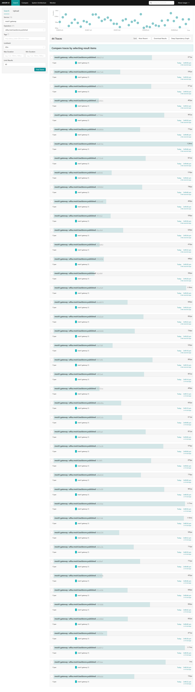
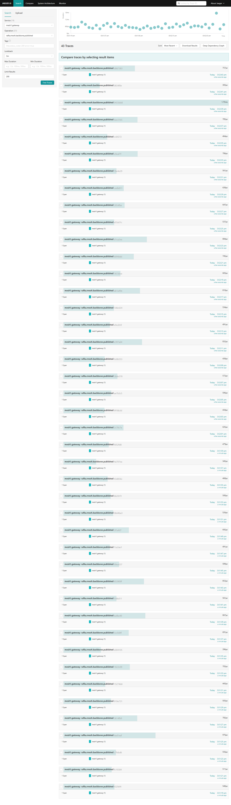
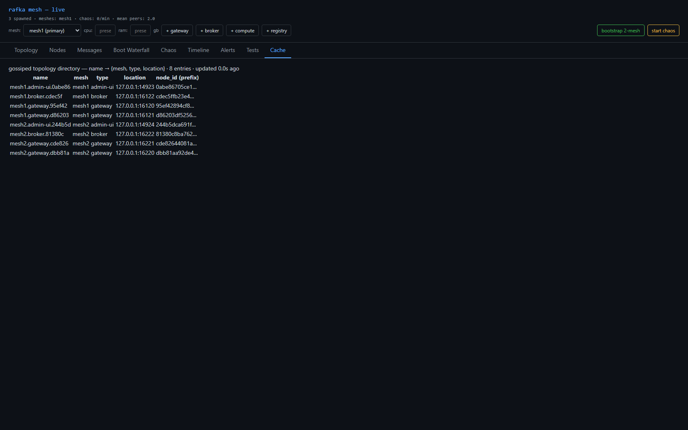
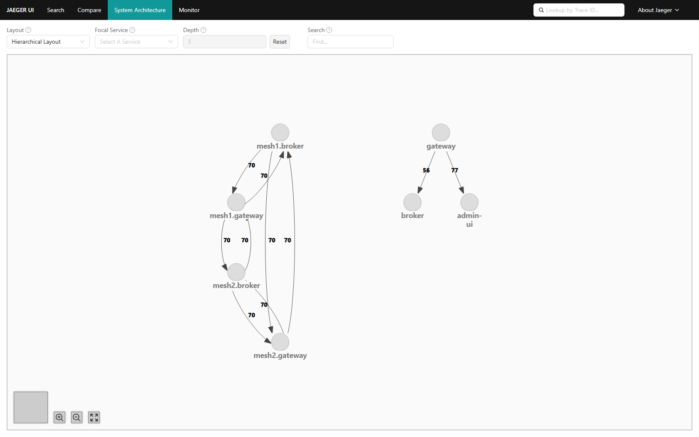
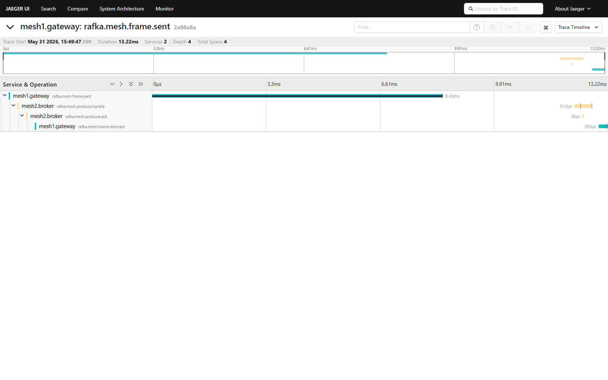

# 4 — A gossip backbone

> Part 4 of *Building a multi-mesh substrate*. Cross-mesh topology + aggregate metrics without a firehose.

[Part 2](02-two-meshes-no-bridge.md) ended on a confession: "the gateway subscribes to the other mesh's
entire gossip" works for two meshes on a laptop and falls over everywhere else. With many meshes and
hundreds of gateways per mesh it's an O(meshes²) firehose of every remote node's per-tick digest, and it
forces the console to special-case itself as an all-mesh subscriber. Time to do it properly.

## Separate the planes

The insight: cross-mesh awareness doesn't need every remote node's heartbeat — it needs a **summary**.
So split the traffic into three channels, all still just iroh:

| plane | channel | carries |
|---|---|---|
| intra-mesh detail | per-mesh gossip `blake3(mesh_id)` | full per-node digests (stay local) |
| **cross-mesh control** | **backbone** topic `blake3("backbone")` | one **summary per mesh**: directory + aggregate metrics |
| cross-mesh data | the relay | the actual write frames, when there's no direct path |

The heavy per-node churn never leaves its mesh. Only a thin rollup crosses.

## The gateway aggregates and publishes

Each mesh's gateway already holds its whole mesh via gossip, so aggregating is a local sum: node count,
total CPU/RAM, throughput, plus the `name → location` directory. It publishes that one `MeshSummary` to
the backbone each interval; everyone else reads summaries instead of subscribing to foreign gossip.

## One publisher per mesh — without an election

Hundreds of gateways, but exactly one should publish per mesh. No Raft, no bully algorithm, no QUIC
handshake — that would be the bespoke infrastructure we keep refusing to build. Instead, a **soft lease
carried on the backbone itself**: the publisher stamps each summary with `published_by` + `expires_at`
and renews it; other gateways defer to a live claim and only contend for a **vacant** seat (lowest node
id breaks that tie). Leadership changes only when the publisher dies — its claim expires, the next
gateway takes over:

Checked it: across 46 backbone publishes for `mesh1` in a 40-minute window, **one** publisher id. No
flapping. The lease holds.

## The console becomes a normal node

This is what finally lets the operator console stop being special. It's now a plain node —
`mesh1.admin-ui.<hex>`, a real mesh, self-named — that sees its **home** mesh in full detail (gossip) and
every other mesh as a **summary** (backbone). Want full per-node detail of another mesh? Run a console in
that mesh. One per mesh, tied together by the backbone:

And the dependency graph stays honest — distinct per-mesh nodes, bidirectional, and the write path is
unchanged because the backbone is control-plane only:

## Takeaway

A backbone topic carrying per-mesh summaries — published under a lease, consumed by everyone — replaces
the all-subscribe-to-everything firehose, scales past hundreds of gateways, and removes the last excuse
for a "special" node. It's one extra gossip topic. No DHT, no consensus. The smallest thing that works,
proven live.
