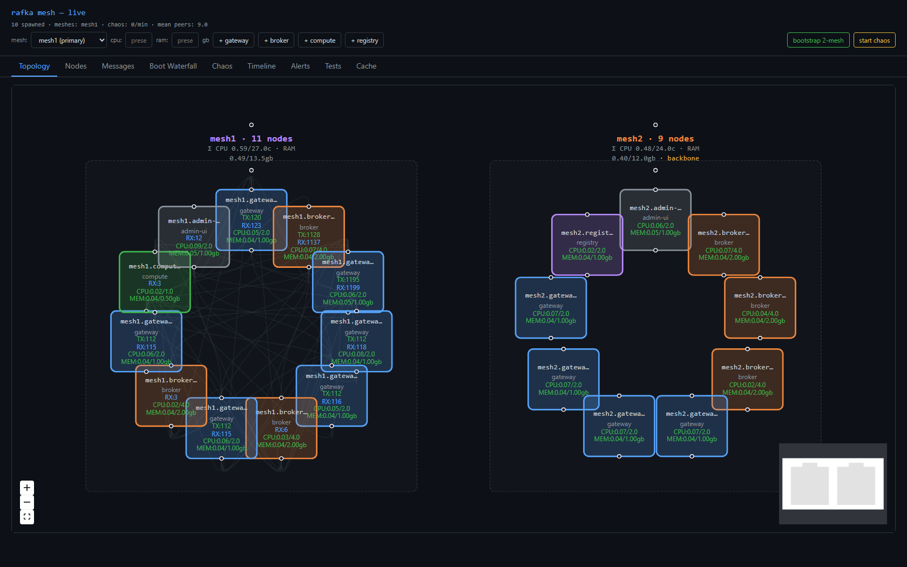
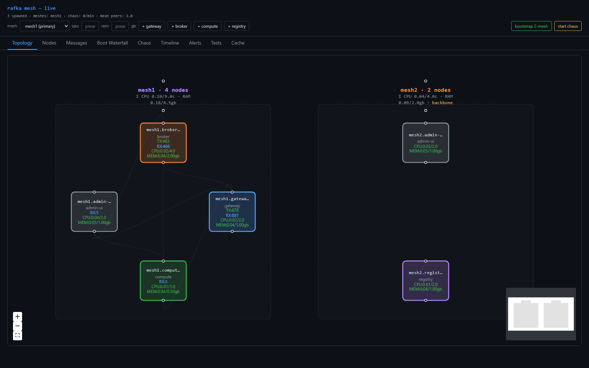
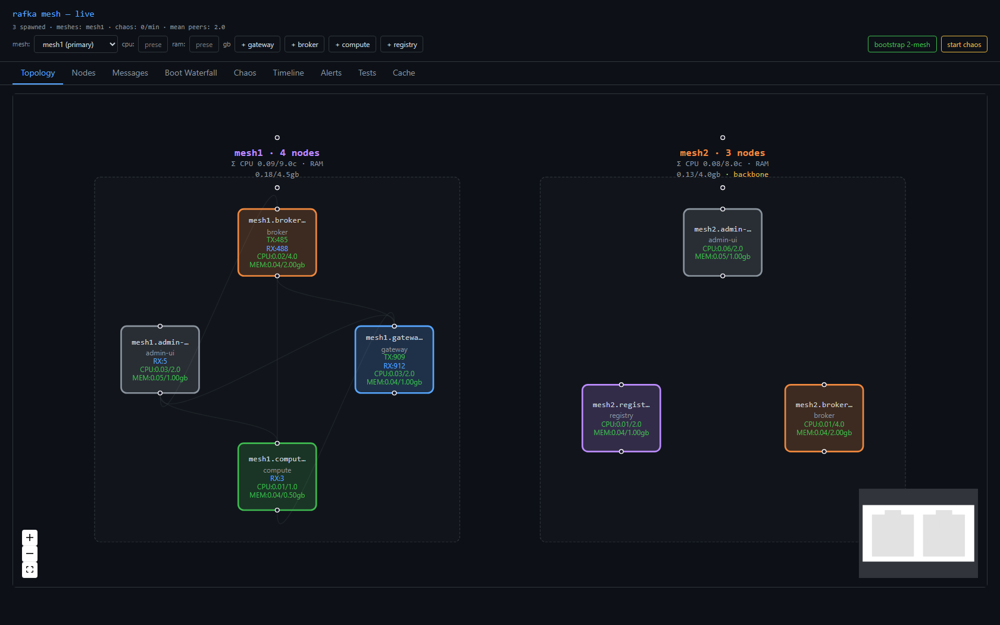
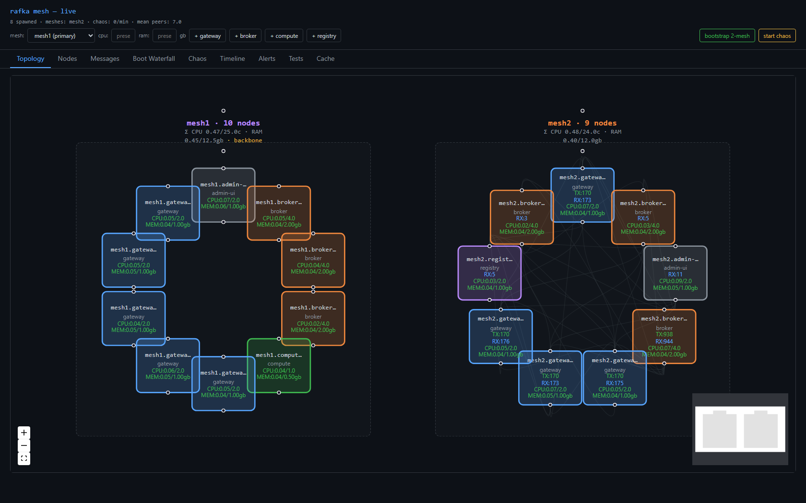

# 9 — Is it ready? (and a thank-you to n0)

> Part 9, the closing post of *Building a multi-mesh substrate*. Before writing the first line of the
> app layer on top, we asked the only honest question: **what have we actually proven, and what are we
> just hoping?** This is the verification sweep — and a long-overdue thank-you to the people whose work
> made all of it possible.

The temptation, after eight posts of green screenshots, is to declare victory and start building. We
didn't. We wrote down every claim the substrate makes, sorted them into *proven*, *deferred*, and *not
our problem*, and then went and ran the ones we could. Here's what held.

## The one caveat that reframes everything

Every "RSS flat / CPU ~0.02 cores / 0 panics" number in this series was measured against **brokers that
do nothing.** They receive a frame, emit a span, and ack in microseconds. So those numbers are **floors
for an empty substrate, not predictions for the real thing.** The moment a broker writes a log, the
latency, the in-flight backlog, and the memory profile all change. We say this loudly because it's the
assumption most likely to crack after you've built on top.

## What we proved this round

### Produce/ack holds under concurrency

We scaled to **ten gateways producing at once** — each writing to a broker in its own mesh and a broker
across the backbone — against five brokers per mesh, and held it for two and a half minutes.

- **600 `produce.handle` in 150 s** (~4/s fleet-wide, steady), and **640 `produce.ack`** — the full
  produce → handle → ack round-trip completing, not just fire-and-forget.
- **Zero `frame.decode_failed`. Zero panics. Zero quinn assertions.** 20 processes throughout, RSS flat
  (+1.2 %, noise).

### The cross-mesh write degrades gracefully and recovers

We killed *both* cross-mesh write targets and watched. The gateway didn't crash, didn't spin (RSS flat,
CPU ~0.09 cores — no retry storm), and the intra-mesh write kept flowing the whole time. Cross-mesh
`produce.handle` fell to **0** during the outage while intra stayed at **7**. Then we brought a broker
back, and the write resumed on its own once the backbone reconverged.

### The backbone survives losing its publisher

The cross-mesh directory is published by one elected node per mesh, on a soft lease. We found the live
lease holder via its `backbone.published` spans, killed it, and confirmed the dead-man's-switch: within
the lease TTL a *different* candidate took over publishing, and the other mesh's console never lost
sight of the first mesh.

## What we deliberately did *not* claim

Honesty is the whole point of a verification post, so:

- **Packet-level network faults** — cutting a link while the process stays alive — needs elevated
  firewall control we didn't have in this environment. Process-fault recovery is proven; true
  partition/flap is not. Documented, not hidden.
- **The relay carrying real traffic live** — proven in an isolated test, but on a single host the direct
  path correctly always wins, so the relay sits idle. That's fine until the first cross-host deployment,
  where it becomes mandatory.
- **Durability, offsets, ordering, backpressure policy, tenancy** — these aren't substrate holes. They
  are *rafka itself*, the app layer we're about to build.

The full ledger lives in [`docs/plans/mesh-v2/05-pre-rafka-verification-gaps.md`](../plans/mesh-v2/05-pre-rafka-verification-gaps.md).

**Verdict: ready to start building on a single host, with eyes open.**

---

## A genuine thank-you to the people behind iroh

Here's the part that matters most.

None of this — not the gossip membership, not the cross-network relay, not the per-mesh topics, not the
QUIC transport that just *worked* across Windows and Linux without us hand-rolling a single NAT
traversal — none of it is ours. It rests entirely on **[iroh](https://github.com/n0-computer/iroh)**,
built in the open by the team at **[n0](https://www.n0.computer/)**.

Go back and reread this series with that in mind. Post 1's clean boot? iroh endpoints. Post 2's two
meshes talking with no bridge? iroh-gossip. Post 5's relay-as-a-postbox? iroh's relay, with a security
model we got *for free*. Post 7, where we needed to prove the relay carries traffic — we did it with
**iroh's own built-in `test_utils`**, cross-platform, no custom harness. Post 8's 40-second-join bug?
The fix was to *stop* hand-rolling an address book and use the `MemoryLookup` iroh already shipped. Over
and over, the right move turned out to be "the thing iroh already does." That is what a genuinely
well-designed library feels like to build on.

It's easy to forget, in a world of green checkmarks, how much of what we build stands on the quiet,
sustained, often-thankless work of open-source maintainers. We are *lucky* — genuinely lucky — to live
in a moment where a small team can hand you a substrate this capable, document it well, answer issues,
and ask nothing in return but that you build something good with it.

So, to the **n0 team** — a giant high-five. 🖐️ Thank you for iroh, for building it in the open, for the
care in the API design that kept steering us away from our own worst instincts, and for the relay
infrastructure and the test utilities and the docs. You made a hard problem feel approachable, and you
made this entire build log possible.

- **iroh** — the repo: <https://github.com/n0-computer/iroh>
- **n0** — the company: <https://www.n0.computer/>
- **iroh** — the project site & docs: <https://www.iroh.computer/>

If you're reading this and you build distributed systems, go star the repo, read their docs, and
consider supporting the work. The whole ecosystem is better for it — and so is everything we're about to
build on top.

Onward to rafka. 🚀
