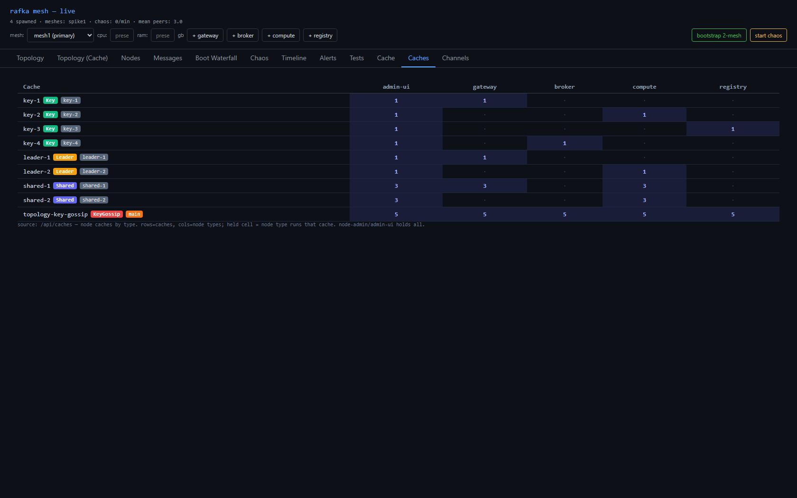
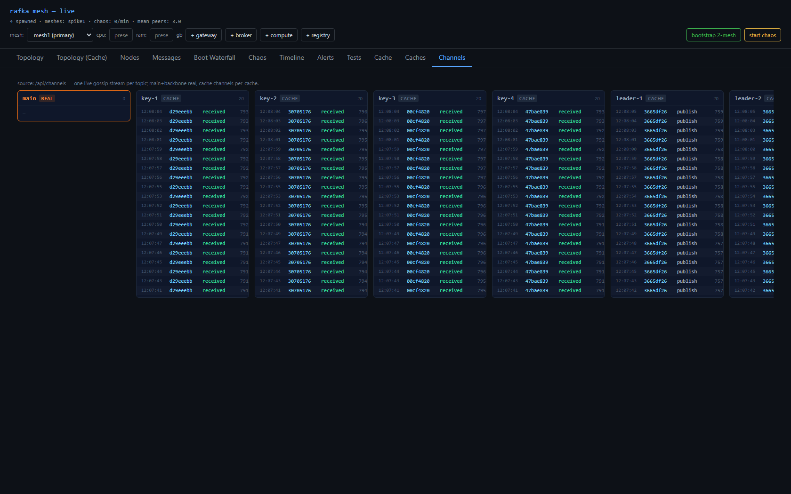

# 10 — Extending the mesh with node caches

> Part 10 of *Building a multi-mesh substrate*. The mesh already tells every node who else is alive.
> This post is about giving each node a *local* view it can route from — and what happens when you
> realize one cache quietly becomes many.

The mesh gossips membership: every node sees every other node's digest land in `live_digests()` —
id, type, address, load, state. That's enough to *know* the mesh. It is not enough to *use* it. To
route — pick a live broker, dial a gateway, hold partition ownership across a blip — a node needs a
stable, queryable view it owns. That view is a cache. This is the layer that turns a membership
substrate into something a product can stand on.

## Why a cache, and why not an API

The tempting wrong answer is to make node-admin the oracle: a node that wants the topology asks it over
HTTP. That's a poll, a central dependency on the hot path, and a cold-start gap where a freshly-booted
node knows nothing until its first request returns. A node should not *ask* who its peers are. It should
already know.

So the cache is a **local projection of gossip the node already receives.** The mesh carries membership
whether you build a cache or not; the topology cache is just that stream, materialized and queryable,
on every node. node-admin's `/api/topology` endpoint still exists — but it's for *humans* looking at a
console, never for a node looking up a peer. Nodes never poll.

## Born knowing

A projection of gossip is current within a second or two of boot — but "a second or two" is a window
where a node can't route. So node-admin, which is the thing that *spawns* nodes, hands each child the
current topology at birth: it snapshots its own view and writes it where the child reads it before
gossip even starts. The node comes up already holding the mesh.

We proved it with a staggered spawn — one node every ~18 seconds, each born into a mesh one larger than
the last:

```
gateway  (1st spawn)  -> born with injected = 1   (admin only)
broker   (2nd spawn)  -> born with injected = 2
compute  (3rd spawn)  -> born with injected = 3
gateway  (4th spawn)  -> born with injected = 4
broker   (5th spawn)  -> born with injected = 5
```

Each node was born knowing *exactly* the mesh that existed at its moment of birth — not an empty cache
it had to fill, not a poll it had to wait on. Gossip takes over from there. The mother hands the child
what it knows; the child grows up on the mesh.

## A cache has to forget

The first version only ever *added*. That looks fine until the mesh churns. We ran a 30-minute chaos
soak — node-admin killing and respawning a random node every 30 seconds, 110 kill/respawn events — and
watched the caches climb: 4 nodes, then 7, then 11, ghosts of every dead node never cleared. Worse, the
nodes *disagreed* — each had accumulated a different set of corpses depending on what it happened to
witness. A topology cache where no two nodes agree is not a topology cache.

The fix is one line of intent: each tick, reconcile against `live_digests()` and drop whatever's no
longer there. And the elegant part — `live_digests()` *already* ages out a node that's gone quiet on the
mesh's ~30-second keep-alive. So the cache doesn't need its own timer or tombstone clock; it inherits the
mesh's. Re-soak, same 30 minutes of carnage: held at 4 the whole way, 59 distinct node ids cycled
through, every node converged. A cache that only learns is a leak. It has to forget on the same clock the
mesh forgets.

## One cache becomes many

Topology is the *first* cache, not the only one. Compute needs virtual-topic assignments; a gateway needs
routing and ACL state; different roles remember different things. So: many caches, on many nodes.

The first model I reached for was a channel per node type — "the gateway channel," carrying everything a
gateway gossips. It's clean right up until a cache is *shared*. Virtual-topic assignments are needed by
compute **and** gateway. On node-type channels, that one cache has to be published on *both* channels —
duplicate traffic, and now every receiver needs to dedup. And a gateway that joins the compute channel
just to hear VT also eats all of compute's private chatter it doesn't care about.

The inversion fixes it: **channel by the data, not by the node.** One gossip topic per *cache type*. A
node subscribes to exactly the caches it needs. A shared cache is simply a topic with more than one
subscriber — no duplication, no dedup, no cache that has to know the list of node types that consume it.
The channel belongs to the cache; the node picks the caches.

## Two axes, and why each cache picks a spot

With caches as first-class things, each one declares two properties — and the two distinctions are the
whole design.

**Channel — `Main` or `Dedicated`.** Most caches get their own topic. But topology *rides main*: the
membership gossip is mandatory for the mesh to function at all, so every node already holds that data for
free — giving topology its own channel would re-ship what everyone already has. "Rides main" is a
*property*, not a topology-shaped hack; any future cache that's a pure projection of membership can pick
it too.

**Write model — who may publish, and how conflicts resolve.** Three kinds:

- **Leader-only.** Only the elected node-admin writes; it assigns the order. Trivial to reason about.
- **Self-key.** Each node writes only its *own* row. Membership is this — *my* digest is *my* key. Two
  nodes can never fight over a key, because the key *is* the writer. No conflict resolution, ever.
- **Shared-key.** Anyone writes any key. This is the only model that needs real conflict resolution — and
  a wall clock will not do it, because clocks skew. It needs a monotonic `epoch` and last-writer-by-epoch.
  Virtual-topic assignments are this.

The trap is treating every write the same. Most caches are *not* shared-key; bolting epoch + resolve onto
a self-key cache is machinery you'll never use, and *omitting* it from a shared-key cache is silent
divergence that passes every test until the day two nodes write the same key a millisecond apart. The
model's job is to make you *say* which one each cache is — so only the caches that actually contend pay
for contention.

## Seeing it

The console grew two tabs, because a design you can't watch is a design you're guessing at.

**Cache** is a matrix — cache types down the side, node types across the top, a live cell wherever a node
holds a cache. The shared caches light up multiple columns, so you can *see* which caches cross roles:

```
                 | admin-ui | gateway | broker | compute | registry
 topology        |    *     |    *    |   *    |    *    |    *      <- rides main; everyone
 vt              |    *     |    *    |        |    *    |           <- shared: gateway + compute
 gateway-cache-1 |    *     |    *    |        |         |
 gateway-cache-2 |    *     |    *    |        |         |
 compute-cache-1 |    *     |         |        |    *    |
 compute-cache-2 |    *     |         |        |    *    |
 compute-cache-3 |    *     |         |        |    *    |
 registry-cache-1|    *     |         |        |         |    *
 broker-cache-1  |    *     |         |   *    |         |
```

(node-admin / admin-ui holds them all — it's the authority and the observer.)



**Channels** is one live stream per gossip topic — `main` and `backbone` (the real mesh traffic), plus a
column per cache channel. The publisher stamped on each event makes the write model *visible*: a
leader-only channel only ever shows node-admin; a shared-key channel shows many writers with climbing
epochs; a self-key channel shows `key == publisher` on every line. The taxonomy isn't a comment in the
code — it's a thing you watch scroll by.



## The lesson

The mesh was the easy part — it already knew who was alive. The hard part was the *shape* of what each
node remembers: born knowing instead of polling, forgetting on the mesh's own clock, channeled by data
instead of by node, and honest about who's allowed to write. Every one of those started with a tidy first
answer — *ask the oracle; only add; one channel per node; a write is a write* — and every tidy answer was
wrong. What corrected each one was the same thing that corrected the bugs in post 8: the live system's own
signal. A 30-minute chaos soak that wouldn't stop growing. A staggered spawn that printed the ramp. A
shared cache that simply would not fit the node-type channel.

Build the layer that lets the system tell you the shape is wrong — then believe it. Same lesson as before,
one layer up.
