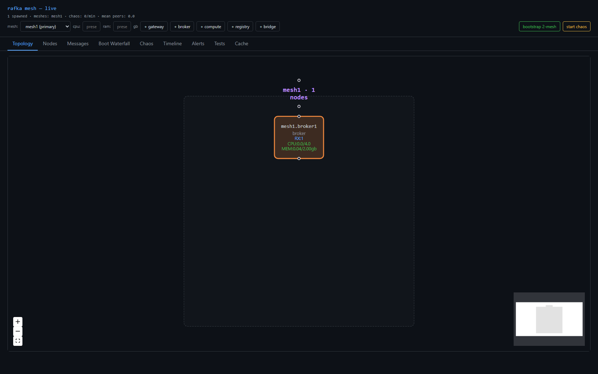
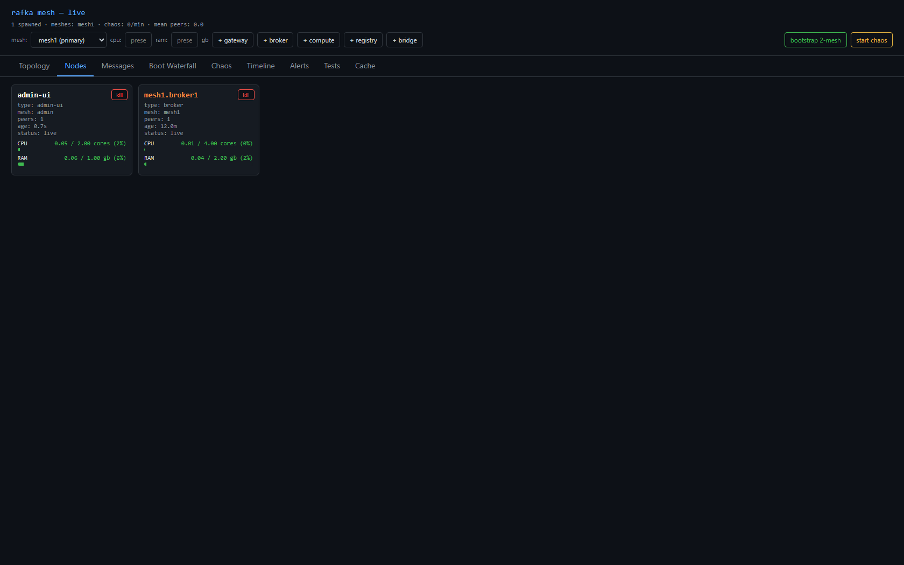
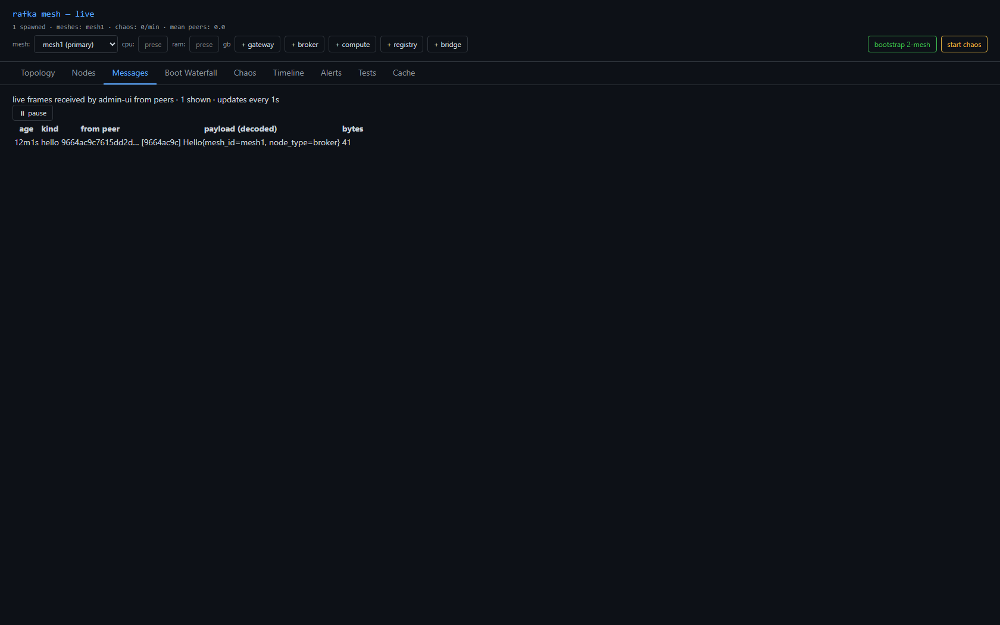
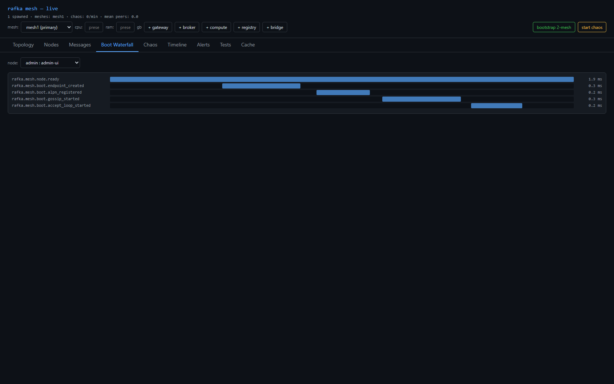
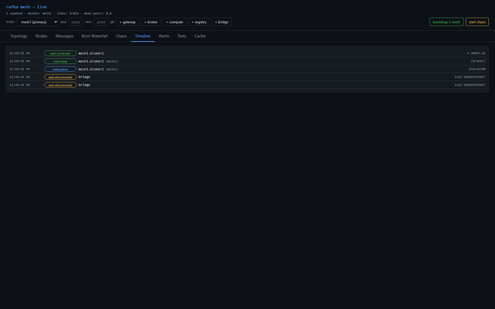
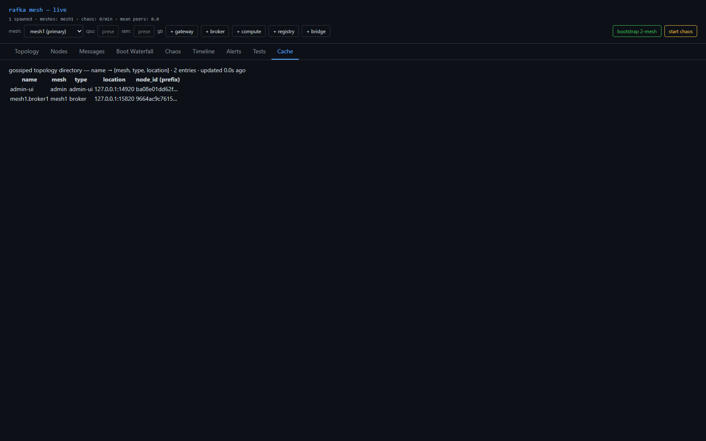
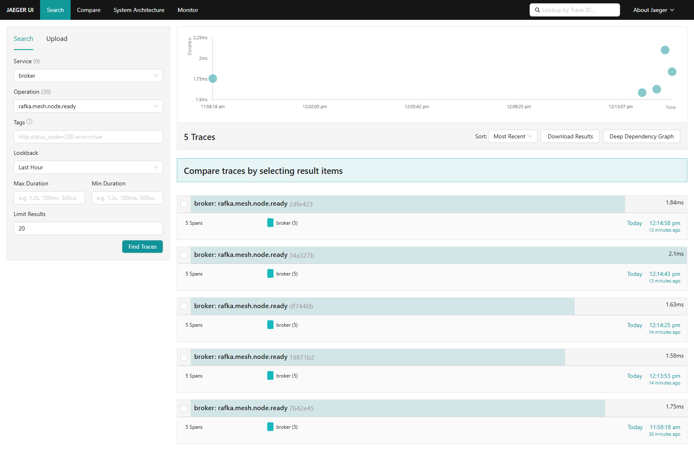
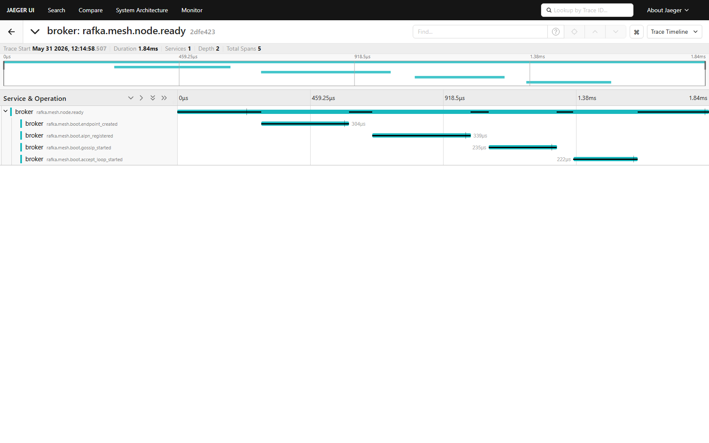

# Sprint 11 — Release Report

**Initiative:** mesh-v2 · **Phase 1** — Base UI + topology cache (one mesh)
**Status:** ✅ Verified by team lead · **Date:** 2026-05-31
**PRD:** `docs/plans/mesh-v2/00-topology-cache-and-base-ui-prd.md` (§8 milestone 1)
**Branch:** `worktree-agent-a4b669faab9e8336b` (to merge into `mesh-v2`)

## Live links
- **Admin-ui (this sprint's instance):** http://localhost:19091
- **Jaeger — broker boot trace:** http://localhost:16686/search?service=broker&operation=rafka.mesh.node.ready&lookback=1h
- **Jaeger — all rafka services:** http://localhost:16686

---

## What was done

A single, deterministically-named broker (`mesh1.broker1`) can be spawned from the admin-ui and is
visible **live** across every surface, including a brand-new **Cache** view, with its boot telemetry
flowing to Jaeger.

- **Deterministic naming** `<mesh>.<role><N>` — `mesh1.broker1` (per-mesh/per-role counter, passed as
  `RAFKA_NODE_NAME` on spawn). Random hex names are gone.
- **`GossipDigest.location`** — new field carrying the node's reachable bind address, broadcast in
  gossip (loopback rewrite for `0.0.0.0`).
- **`GET /api/topology-cache`** — the gossiped directory `name → {mesh, type, location}`, built from
  `live_digests()` (real gossip, not hardcoded).
- **Cache tab** — new React/Vite tab rendering that directory.
- **CPU/RAM bars** preserved on node cards.

## Verification (team lead, independent)

- `cargo check --workspace --tests --no-default-features` → **0 errors, 0 warnings**.
- Curled `http://localhost:19091/api/topology-cache` → live JSON, `mesh1.broker1 @ 127.0.0.1:15820`.
- Read `handle_topology_cache` (iterates `live_digests()`) and `GossipDigest.location` (from bind addr).
- Captured + eyeballed every screenshot below.

---

## UI — `mesh1.broker1` live across all surfaces

### Topology

### Nodes (CPU/RAM bars)

### Messages

### Boot Waterfall

### Timeline

### Cache (new)

---

## Telemetry — raw Jaeger UI (`localhost:16686`)

### Search: `service=broker`, `operation=rafka.mesh.node.ready` — 5 traces, 5 spans each

### Trace detail: the boot-span chain (`node.ready` → `endpoint_created` → `alpn_registered` → `gossip_started` → `accept_loop_started`)

---

## Acceptance criteria — met

| Criterion | Result |
|---|---|
| `cargo check` clean (0/0) | ✅ |
| `+broker` → `mesh1.broker1` in all 5 surfaces + Cache | ✅ |
| `/api/topology-cache` returns live (gossip-derived) entry | ✅ |
| UI screenshots in sprint folder | ✅ `screenshots/ui-*.png` |
| Jaeger telemetry screenshot in sprint folder | ✅ `screenshots/jaeger-*.png` |
| Team lead personally verified screenshots | ✅ |

## Deferred to later sprints
- Two-mesh / cross-mesh cache + **bridge removal** → **sprint-12**
- Add/delete multi-node → **sprint-13**
- Forced relay (relay carries cross-mesh) → **sprint-14**
- Chaos + resilience soak → **sprint-15**

**Jaeger deliverable URL:** `http://localhost:16686/search?service=broker&operation=rafka.mesh.node.ready&lookback=1h`
