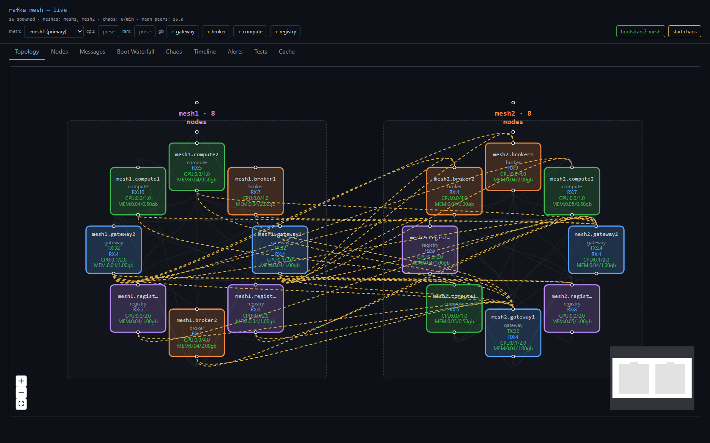
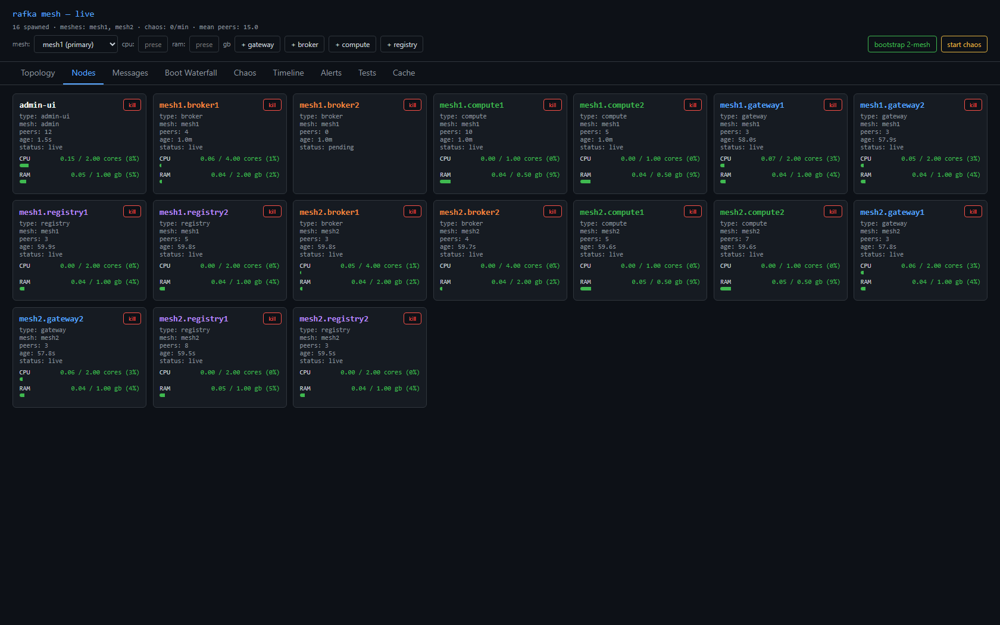
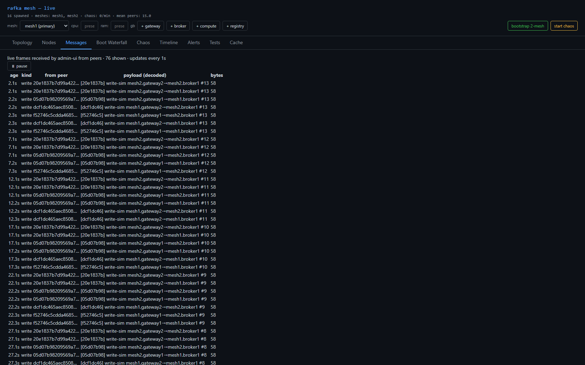
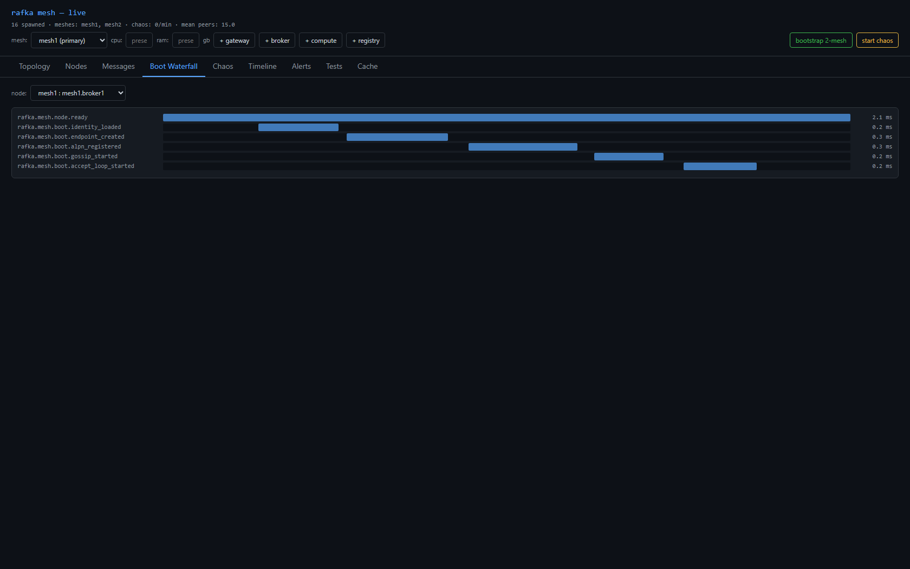
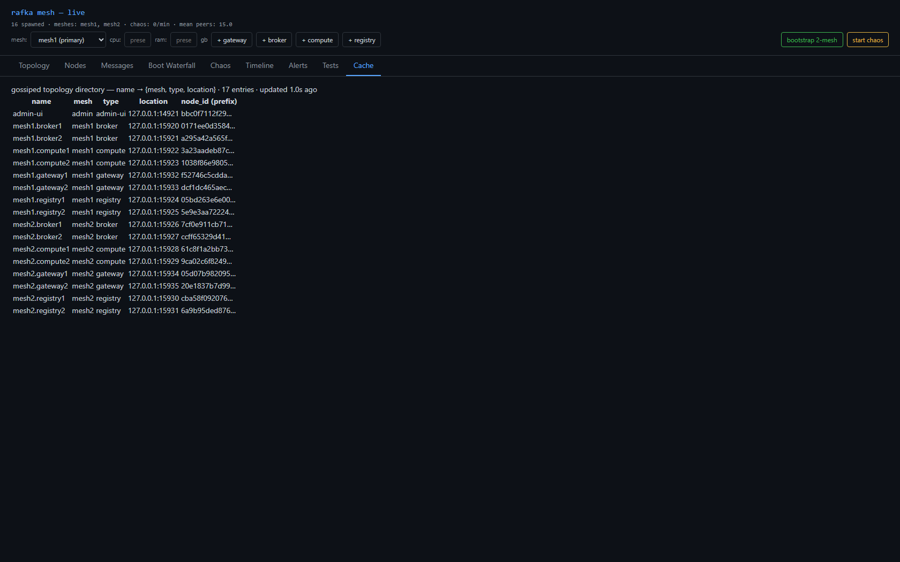
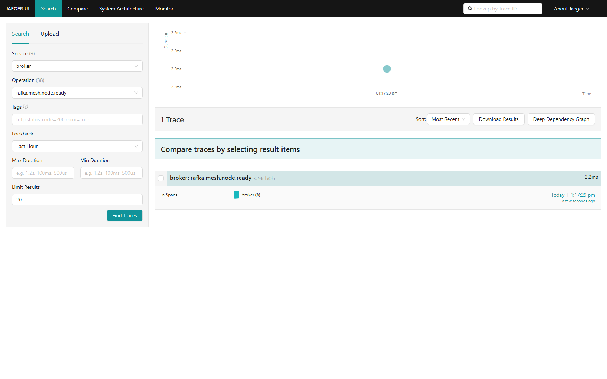
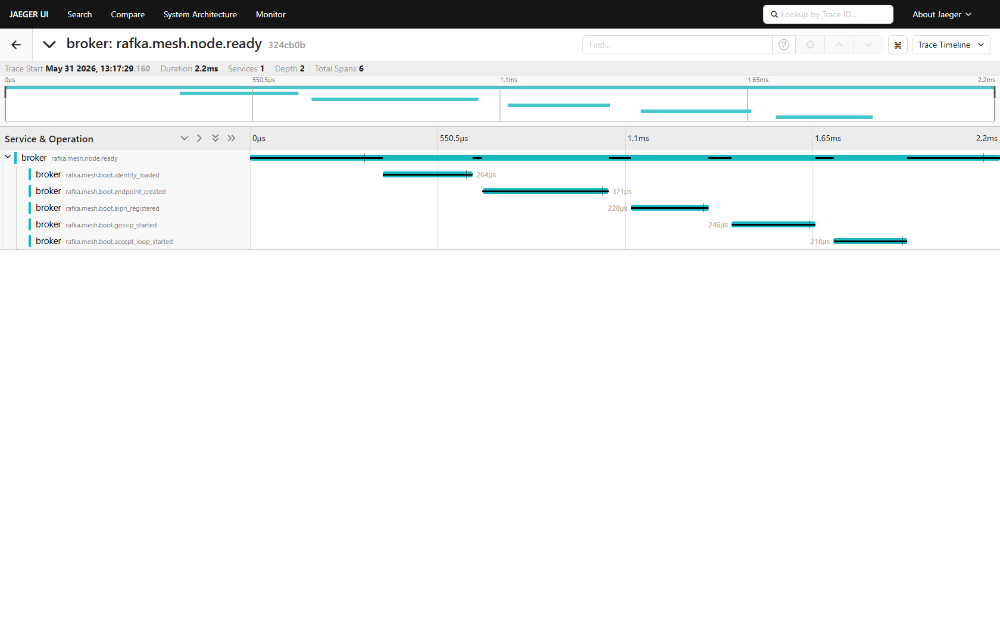

# Sprint 12 — Release Report

**Initiative:** mesh-v2 · **Phase 2** — Two-mesh cross-mesh cache, bridge removed
**Status:** ✅ Verified by team lead · **Date:** 2026-05-31
**PRD:** `docs/plans/mesh-v2/00-topology-cache-and-base-ui-prd.md` (§2,§3,§4,§5,§8.2,§6a)
**Branch:** `worktree-agent-a4b669faab9e8336b` · tip `61f2a46` (to merge into `mesh-v2`)

## Live links
- **Admin-ui (this sprint's instance):** http://localhost:19092
- **Topology:** http://localhost:19092/topology · **Nodes:** http://localhost:19092/nodes · **Messages:** http://localhost:19092/messages · **Cache:** http://localhost:19092/cache · **Boot Waterfall:** http://localhost:19092/boot-waterfall
- **Jaeger — broker boot trace:** http://localhost:16686/search?service=broker&operation=rafka.mesh.node.ready&lookback=1h
- **Jaeger — all services:** http://localhost:16686

---

## What was done

The **bridge is gone**, and two meshes share a cross-mesh topology cache with real cross-mesh delivery —
plus direct-URL tab routing and a completed boot-span chain.

- **Bridge removed entirely** — deleted the `bridge/` crate + workspace member, `Role::Bridge`,
  `RAFKA_BRIDGE_TARGET_MESHES`, the `+bridge` button, and every bridge reference in
  bootstrap/seeds/topology/colors/chaos/cli.
- **Cross-mesh without a bridge (PRD §2)** — when the admin-ui spawns a `gateway` it passes
  `RAFKA_OBSERVER_MESHES` = the other meshes + a cross-mesh seed, so the gateway's process-global
  `live_digests()` spans both meshes. That membership draws the direct gateway→broker cross-mesh edge.
- **Cross-mesh write-sim (PRD §3)** — `mesh1.gateway1` resolves `mesh2.broker1` from the cache and writes
  to it directly (`op_kind=produce`).
- **Direct-URL tab routing (PRD §6a)** — clean paths (`/cache`, `/topology`, …), client router + an axum
  SPA fallback for non-`/api` non-asset GETs.
- **Boot chain completed** — `identity_loaded` moved into `node.ready`'s trace → **6 spans** (was 5).

## Verification (team lead, independent — not the agent's word)

- `cargo check --workspace --tests --no-default-features` → **0 errors, 0 warnings** (re-ran myself).
- `GET /api/topology-cache` → **17 entries, 0 bridge, both meshes** (mesh1 + mesh2 + admin-ui).
- `GET /api/heartbeats` → `mesh2.broker1.frames_recv_total = 155` (cross-mesh write genuinely lands).
- `GET /cache` → **HTTP 200**, serves the SPA (path routing + fallback work).
- Captured the **raw Jaeger** 6-span trace myself (trace `324cb0b`).
- Spawned `mesh1.broker3` live → deterministic counter increments correctly.

---

## UI

### Topology — two meshes, no bridge, cross-mesh edges

### Nodes — 16 nodes + admin-ui, CPU/RAM bars

### Messages — cross-mesh write-sim frames

### Boot Waterfall — 6 spans (identity_loaded now included)

### Cache via direct `/cache` URL — 17 entries across both meshes, no bridge, no `+bridge` button

---

## Telemetry — raw Jaeger UI (`localhost:16686`)

### Search: `service=broker / rafka.mesh.node.ready`

### Trace `324cb0b` — the COMPLETE 6-span boot chain (`node.ready` → identity_loaded → endpoint_created → alpn_registered → gossip_started → accept_loop_started)

---

## Acceptance criteria — met

| Criterion | Result |
|---|---|
| `cargo check` clean (0/0) | ✅ (lead re-ran) |
| No bridge anywhere (cache, button, crate) | ✅ |
| Cache spans both meshes (17 entries) | ✅ |
| Cross-mesh delivery real (`mesh2.broker1` RX climbing) | ✅ 155 frames |
| Boot chain = 6 spans incl. identity | ✅ raw Jaeger `324cb0b` |
| Direct-URL tab routing (`/cache`) | ✅ HTTP 200 SPA |
| UI + Jaeger screenshots in folder; lead verified | ✅ |

## Known follow-ups (honest)
- Dead-code `_HTML_LEGACY_REMOVED` const in `admin-ui/src/main.rs` still contains a `+ Spawn bridge`
  string — never served (`#[allow(dead_code)]`, `ServeDir` serves `web/dist`). Cosmetic; delete next pass.
- The admin-ui observer needs `RAFKA_MDNS_ENABLE=false` on a shared host, or it mDNS-discovers other
  fleets' digests on the same `blake3(mesh_id)` topic. (Not a code bug — operational.)

## Deferred
- Add/delete multi-node → **sprint-13** · Forced relay (relay carries cross-mesh) → **sprint-14** · Chaos + soak → **sprint-15**
