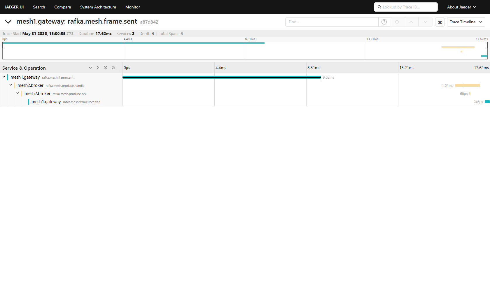
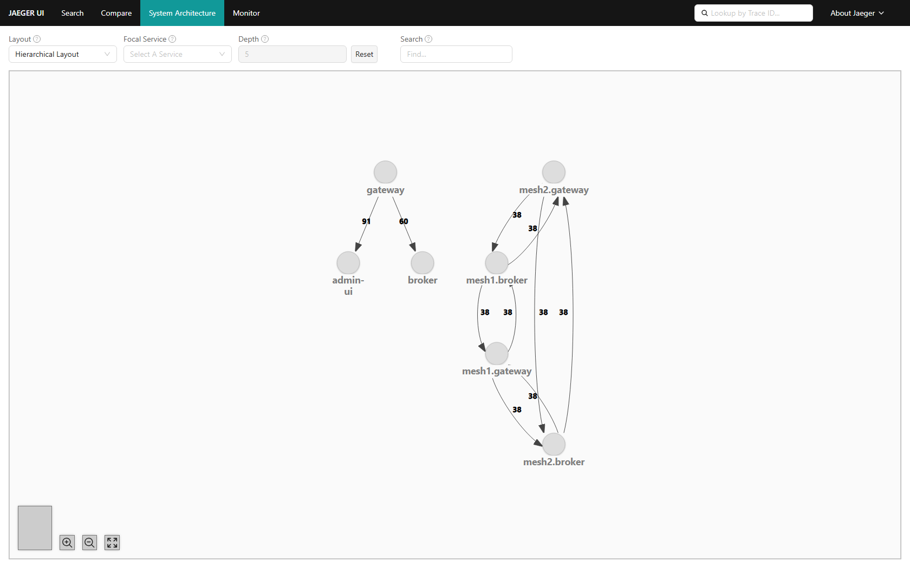
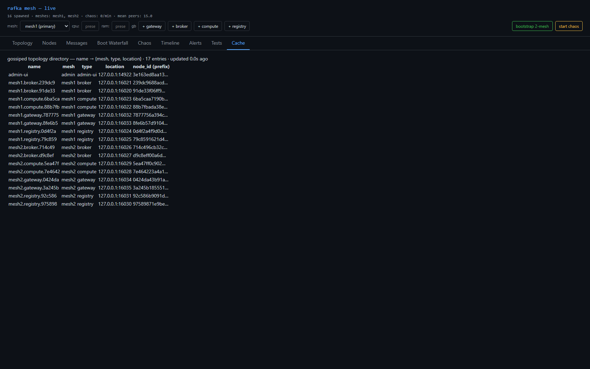
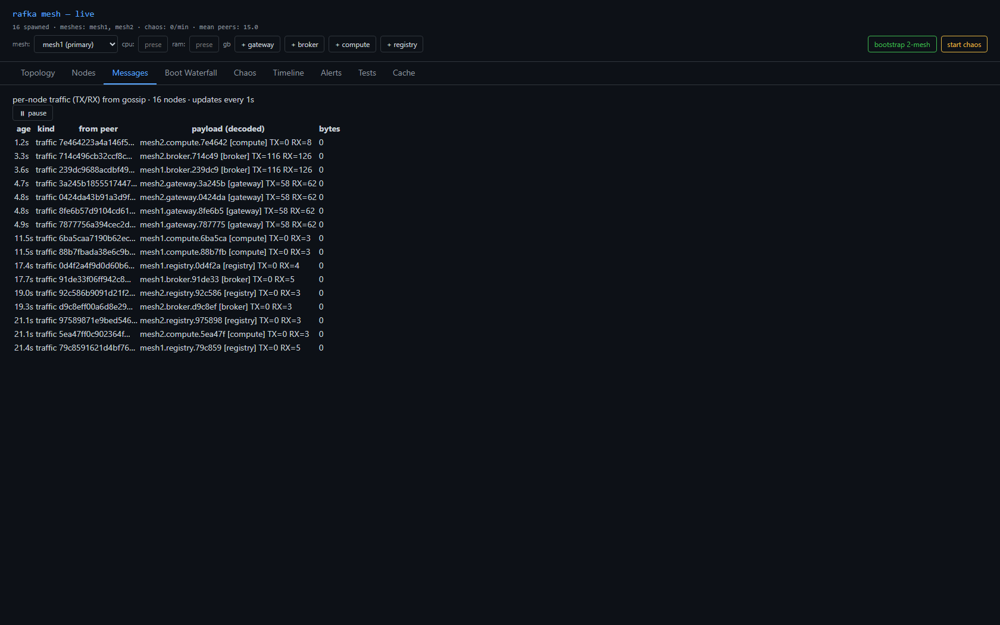

# Sprint 13 — Release Report

**Initiative:** mesh-v2 · **Telemetry hierarchy + honest topology**
**Status:** ✅ Verified by team lead · **Date:** 2026-05-31
**Spec:** `docs/telemetry.md` Part B · **Branch:** `worktree-agent-a4b669faab9e8336b` · tip `d96af4c`

## Live links
- **Admin-ui:** http://localhost:19093 · tabs: [/topology](http://localhost:19093/topology) · [/cache](http://localhost:19093/cache) · [/messages](http://localhost:19093/messages)
- **Jaeger — System Architecture (dependency graph):** http://localhost:16686/dependencies
- **Jaeger — a per-mesh service:** http://localhost:16686/search?service=mesh2.broker&lookback=1h

---

## What was done

The Jaeger graph now reflects **real two-mesh topology**, propagation is **standard W3C**, the broker's
work is **in the trace**, and the observability **CC artifact is gone**.

- **B1 — service hierarchy + self-naming.** Each node derives its own identity at boot:
  `node_name = <mesh>.<type>.<first-6-hex-of-node_id>` (e.g. `mesh1.broker.239dc9`), `service.name =
  <mesh>.<type>`, `service.namespace = <mesh>`, `service.instance.id = full node_id`. The admin-ui
  passes only `RAFKA_MESH_ID` + node_type; the ordinal counter is gone. **`RAFKA_MESH_ID` is required —
  fail-fast, no `"default"`.**
- **B2 — full resource.** `build_resource()` = `Resource::default().merge(service.name)`, so
  `OTEL_RESOURCE_ATTRIBUTES` (namespace + instance.id) survives.
- **B3 — W3C over QUIC.** Hand-rolled `TraceContext` replaced by a `W3CCarrier` driven by the global
  `TextMapPropagator` (`traceparent` + **`tracestate`**); round-trip + tracestate unit tests pass.
- **B4 — CC dropped.** The gateway→admin-ui write CC is gone; `/api/messages` derives from gossiped
  per-node `frames_sent/recv_total`.
- **B5 — broker continues the trace + ACKs.** Write-sim `open_uni`→`open_bi`; broker opens
  `produce.handle` + `produce.ack` (W3C-parented), gateway reads the ack → reverse edge.
- **B6 — CLAUDE.md §10** updated: service-name contract, `produce.handle`/`produce.ack`, `op_kind="ack"`.

## Verification (team lead, independent)

- `cargo check --workspace --tests --no-default-features` → **0 errors, 0 warnings** (re-ran).
- **Live `/api/dependencies` curl:** distinct per-mesh nodes; bidirectional `mesh1.gateway → mesh2.broker`
  **and** `mesh2.broker → mesh1.gateway` (36 each); **mesh-qualified → admin-ui edges = 0** (the CC is
  genuinely gone — the only `→ admin-ui` edge has a flat `gateway` parent = the old `:19092` fleet).
- **Cross-mesh produce trace** inspected: `frame.sent → produce.handle → produce.ack → frame.received`,
  Services 2 (`mesh1.gateway` + `mesh2.broker`).
- **Cache** shows self-derived `mesh1.broker.239dc9`-style names, hex matching the node_id column.

---

## Telemetry — raw Jaeger UI

### Cross-mesh produce trace — broker's work + ack in one trace (the load-bearing proof)

### System Architecture — distinct per-mesh nodes, arrows BOTH ways

> The mesh-qualified cluster (`mesh1.gateway`/`mesh1.broker`/`mesh2.gateway`/`mesh2.broker`, all 38/38
> bidirectional, **no admin-ui edge**) is sprint-13. The separate `gateway→admin-ui`/`gateway→broker`
> component is the still-running pre-sprint-13 `:19092` fleet (flat names + old CC) — provably not
> sprint-13 (zero mesh-qualified→admin-ui edges in `/api/dependencies`).

## UI

### Cache — self-derived `<mesh>.<type>.<6hex>` names

### Messages — gossip-derived per-node TX/RX (no CC)

---

## Acceptance — met

| Criterion | Result |
|---|---|
| `cargo check` 0/0 | ✅ lead re-ran |
| Distinct per-mesh service nodes (not collapsed `broker`) | ✅ |
| Cross-mesh write `mesh1.gateway → mesh2.broker` **and** ack reverse arrow | ✅ 36/36 |
| Broker work in the trace (`produce.handle`→`produce.ack`) | ✅ trace `a87d842` |
| W3C `traceparent` + `tracestate` over QUIC | ✅ unit tests + cross-mesh stitch |
| No mesh-qualified → admin-ui edge (CC gone) | ✅ 0 edges |
| Self-named `<mesh>.<type>.<6hex>`, `mesh_id` required | ✅ |

## Honest notes / follow-ups
- **admin-ui still flat (`admin-ui` / `admin` mesh) — NOT normalized.** Your "node like any other"
  directive lands in **sprint-14 (backbone)**: until the backbone gives it per-mesh summaries, it must
  special-observe every mesh to render the global view, so normalizing it only makes sense with the
  backbone. Deferred there, not dropped.
- The visible `gateway → admin-ui` edge is the **old `:19092` fleet** (verified: 0 mesh-qualified→admin-ui).
- `4-boot-waterfall.png` shows empty — Jaeger all-in-one search-index flakiness; `GET /api/boot-trace?service=mesh1.broker.239dc9` returns the full 6-span chain. Not a sprint-13 exit criterion.

## Deferred
Backbone control plane → **sprint-14** (also normalizes admin-ui) · add/delete → **15** · forced relay → **16** · chaos → **17**.
